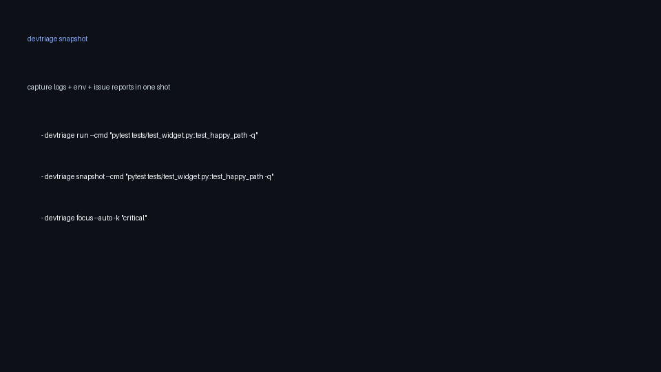

# Devtriage

 [](https://badge.fury.io/py/devtriage)

`Devtriage` is a lightweight CLI that turns a failing command into a reproducible bug report. It captures stdout/stderr, environment data, git context, and produces shareable snapshots or issue templates so teammates can reproduce failures quickly.

## Features
- `run`: execute any command and capture stdout/stderr plus exit metadata.
- `snapshot`: record environment info (OS, Python, pip freeze, git status, sanitized env vars) and bundle it together with command output in a zip archive.
- `issue`: run `snapshot`, emit an `ISSUE.md`, and optionally auto-open a GitHub issue with `--gh` (uses the GitHub CLI).
- `focus`: auto-detect pytest/nose/jest/mocha (or force with `--runner`) and only run changed tests or `-k`/pattern filters.
- Safety-first: sensitive env values (`KEY`, `SECRET`, `TOKEN`, etc.) are redacted before writing `env.json`.
- Visual proof: screenshot of the CLI flow.

```
Devtriage/
├── src/devtriage
│   ├── __init__.py
│   ├── cli.py        # argparse + entrypoint
│   ├── capture.py    # run/snapshot/issue logic
│   └── runners.py    # focus-mode heuristics
├── tests/            # pytest suite for runner detection
├── README.md
└── pyproject.toml
```

## Installation
- Stable release: `pip install devtriage`
- From source: clone and run `pip install -e .`

Either path installs the `devtriage` console script (or run `python -m devtriage`). Python 3.8+ is required.

## Usage
### Capture a failing test
```
devtriage run --cmd "pytest tests/test_widget.py::test_happy_path -q" --out ./triage/widget_fail
```
The target directory receives `stdout.txt`, `stderr.txt`, and `meta.json` describing the run.

### Snapshot & share
```
devtriage snapshot --cmd "pytest tests/test_widget.py::test_happy_path -q" --out ./triage/widget_fail
```
This writes `env.json` plus a timestamped `devtriage_snapshot_*.zip` with everything you need for a bug report.

### Generate an Issue
```
devtriage issue --cmd "pytest tests/test_widget.py::test_happy_path -q" --title "Widget test regression" --out ./triage/widget_fail
```
`ISSUE.md` summarizes the failure, environment, and includes the snapshot path. You can paste it into GitHub/GitLab, or use `--gh` to automatically open a GitHub issue via the GitHub CLI.

### Focused test runs
- Auto-detect: `devtriage focus --auto`
- Force a runner: `devtriage focus --runner jest -k "critical"`
- Legacy flag: `devtriage focus --pytest`

`devtriage` inspects `git diff --name-only HEAD` to find relevant tests for Python and JavaScript ecosystems. When no changed tests exist, pass `-k/--runner` to run the full suite with filters.

## Visual proof


## Contributing
1. Fork and clone the repo.
2. Create a virtual environment and install with `pip install -e .[dev]`.
3. Run `pytest` to execute automated checks (including runner detection + sanitization).
4. Run `devtriage --help` to validate the CLI locally.
5. Open pull requests with a clear description plus tests/recordings when relevant.

[DevMubarak1/Devtriage](https://github.com/DevMubarak1/Devtriage).

## License
MIT © 2025 devtriage contributors

